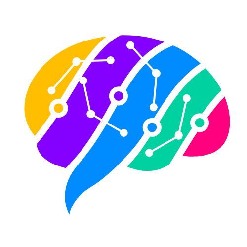

# 🧠 Brainn - Modern Coding Education Platform

<div align="center">
  
  
  <p align="center">
    <strong>Empowering the next generation of developers through interactive learning</strong>
  </p>
  
  <p align="center">
    A comprehensive educational platform designed to transform how people learn programming through structured courses, hands-on projects, and real-world coding challenges.
  </p>

  <!-- Tech Stack Badges -->
  <p align="center">
    
  </p>

  <!-- License Badge -->
  <p align="center">
    
  </p>

  <!-- Social Links -->
  <p align="center">
    <a href="https://linkedin.com/in/YOUR_LINKEDIN" target="_blank">
      
    </a>
    <a href="https://twitter.com/YOUR_TWITTER" target="_blank">
      
    </a>
    <a href="https://github.com/YOUR_GITHUB" target="_blank">
      
    </a>
    <a href="https://portfolio.example.com" target="_blank">
      
    </a>
  </p>
</div>

---

## 📋 Table of Contents

- [🎯 Overview](#-overview)
- [🎨 UI/UX Showcase](#-uiux-showcase)
- [✨ Key Features](#-key-features)
- [🏗️ Architecture & Tech Stack](#️-architecture--tech-stack)
- [🔌 API Documentation](#-api-documentation)
- [🤝 Contributing](#-contributing)
- [📄 License](#-license)
- [📞 Contact & Support](#-contact--support)

---

## 🎯 Overview

Brainn is a next-generation educational platform that revolutionizes programming education through:

- **Interactive Learning**: Hands-on coding exercises with real-time feedback
- **Project-Based Curriculum**: Build real applications while learning
- **Adaptive Learning Paths**: Personalized content based on skill level and goals
- **Community-Driven**: Collaborative learning environment with peer support
- **Industry-Relevant**: Curriculum designed with input from tech industry professionals

### 🌟 Mission Statement
To democratize quality programming education and bridge the gap between academic learning and industry requirements.

---

## 🎨 UI/UX Showcase

<div align="center">
  
  ### 📱 Modern Interface Design
  
  <table>
    <tr>
      <td align="center">
        
        <br />
        <strong>Interactive Dashboard</strong>
      </td>
      <td align="center">
        
        <br />
        <strong>Course Interface</strong>
      </td>
    </tr>
    <tr>
      <td align="center">
        
        <br />
        <strong>Integrated Code Editor</strong>
      </td>
      <td align="center">
        
        <br />
        <strong>Progress Tracking</strong>
      </td>
    </tr>
  </table>

  ### 🎨 Design Principles
  
  <table>
    <tr>
      <th>🎯 User-Centric</th>
      <th>🎨 Modern Aesthetic</th>
      <th>📱 Responsive Design</th>
      <th>♿ Accessibility</th>
    </tr>
    <tr>
      <td>Intuitive navigation with user-friendly workflows</td>
      <td>Clean, minimalist design with smooth animations</td>
      <td>Seamless experience across all devices</td>
      <td>WCAG 2.1 compliant with keyboard navigation</td>
    </tr>
  </table>

</div>

---

## ✨ Key Features

<div align="center">
  
  ### 🔥 Core Capabilities
  
  <table>
    <tr>
      <td align="center" width="25%">
        
        <br />
        <strong>Real-time Code Execution</strong>
        <br />
        <small>Instant feedback with integrated compiler</small>
      </td>
      <td align="center" width="25%">
        
        <br />
        <strong>Hands-on Projects</strong>
        <br />
        <small>Build real applications while learning</small>
      </td>
      <td align="center" width="25%">
        
        <br />
        <strong>Personalized Learning</strong>
        <br />
        <small>AI-driven curriculum adaptation</small>
      </td>
      <td align="center" width="25%">
        
        <br />
        <strong>Peer Collaboration</strong>
        <br />
        <small>Forums, code reviews, and mentorship</small>
      </td>
    </tr>
  </table>

  ### 🛠️ Advanced Features
  
  - **🎯 Smart Progress Tracking**: AI-powered analytics to track learning patterns
  - **🏆 Gamification System**: Badges, leaderboards, and achievement unlocks
  - **💼 Industry Integration**: Real company projects and internship opportunities
  - **🔒 Secure Code Environment**: Sandboxed execution with security monitoring
  - **📊 Comprehensive Analytics**: Detailed insights into learning performance
  - **🌐 Multi-language Support**: Content available in multiple languages
  - **📱 Mobile Learning**: Native mobile apps for learning on-the-go
  - **🎥 Video Integration**: Interactive video lessons with code-along exercises

</div>

---

## 🏗️ Architecture & Tech Stack

### 🎨 Frontend Architecture

<div align="center">
  
  <table>
    <tr>
      <th width="20%">Category</th>
      <th width="40%">Technologies</th>
      <th width="40%">Purpose</th>
    </tr>
    <tr>
      <td><strong>Core Framework</strong></td>
      <td>
        
      </td>
      <td>Component-based UI with type safety and fast builds</td>
    </tr>
    <tr>
      <td><strong>State Management</strong></td>
      <td>
        
        
      </td>
      <td>Predictable state management with persistence</td>
    </tr>
    <tr>
      <td><strong>Styling & UI</strong></td>
      <td>
        
        
      </td>
      <td>Modern, responsive design with smooth animations</td>
    </tr>
    <tr>
      <td><strong>Data Visualization</strong></td>
      <td>
        
        
      </td>
      <td>Interactive charts and progress visualization</td>
    </tr>
  </table>

</div>

### ⚙️ Backend Architecture

<div align="center">
  
  <table>
    <tr>
      <th width="20%">Category</th>
      <th width="40%">Technologies</th>
      <th width="40%">Purpose</th>
    </tr>
    <tr>
      <td><strong>Runtime & Framework</strong></td>
      <td>
        
      </td>
      <td>High-performance server-side JavaScript</td>
    </tr>
    <tr>
      <td><strong>Database</strong></td>
      <td>
        
        
      </td>
      <td>NoSQL database with ODM for flexible data modeling</td>
    </tr>
    <tr>
      <td><strong>Authentication</strong></td>
      <td>
        
        
      </td>
      <td>Secure token-based authentication with password hashing</td>
    </tr>
    <tr>
      <td><strong>Cloud Services</strong></td>
      <td>
        
      </td>
      <td>CDN, file storage, and media optimization</td>
    </tr>
  </table>

</div>

## 🔌 API Documentation

<div align="center">

### 🔐 Authentication Endpoints

| Method | Endpoint | Description | Auth Required |
|--------|----------|-------------|---------------|
| `POST` | `/api/auth/register` | User registration | ❌ |
| `POST` | `/api/auth/login` | User login | ❌ |
| `POST` | `/api/auth/logout` | User logout | ✅ |
| `POST` | `/api/auth/refresh` | Refresh access token | ❌ |
| `POST` | `/api/auth/forgot-password` | Request password reset | ❌ |
| `POST` | `/api/auth/reset-password` | Reset password | ❌ |
| `GET` | `/api/auth/verify-email/:token` | Verify email address | ❌ |

### 📚 Course Management

| Method | Endpoint | Description | Auth Required |
|--------|----------|-------------|---------------|
| `GET` | `/api/courses` | Get all courses | ❌ |
| `GET` | `/api/courses/:id` | Get course by ID | ❌ |
| `POST` | `/api/courses` | Create new course | ✅ (Admin) |
| `PUT` | `/api/courses/:id` | Update course | ✅ (Admin) |
| `DELETE` | `/api/courses/:id` | Delete course | ✅ (Admin) |
| `POST` | `/api/courses/:id/enroll` | Enroll in course | ✅ |
| `GET` | `/api/courses/:id/progress` | Get course progress | ✅ |

### 👤 User Management

| Method | Endpoint | Description | Auth Required |
|--------|----------|-------------|---------------|
| `GET` | `/api/users/profile` | Get user profile | ✅ |
| `PUT` | `/api/users/profile` | Update user profile | ✅ |
| `GET` | `/api/users/dashboard` | Get user dashboard data | ✅ |
| `GET` | `/api/users/achievements` | Get user achievements | ✅ |
| `POST` | `/api/users/avatar` | Upload profile avatar | ✅ |

---

## 🤝 Contributing

<div align="center">

We welcome contributions from the community! Here's how you can get involved:

### 🚀 Quick Start for Contributors

<table>
  <tr>
    <td align="center">
      
      <br />
      Fork the repository
    </td>
    <td align="center">
      
      <br />
      Clone your fork locally
    </td>
    <td align="center">
      
      <br />
      Create feature branch
    </td>
    <td align="center">
      
      <br />
      Submit Pull Request
    </td>
  </tr>
</table>

### 💻 Development Workflow

```bash
# 1. Fork the repository and clone it
git clone https://github.com/YOUR_USERNAME/brainn.git
cd brainn

# 2. Create a feature branch
git checkout -b feature/amazing-feature

# 3. Make your changes and commit
git commit -m 'Add amazing feature'

# 4. Push to your branch
git push origin feature/amazing-feature

# 5. Open a Pull Request
```

### 📋 Code Standards

- ✅ Follow ESLint and Prettier configurations
- ✅ Write meaningful commit messages
- ✅ Add tests for new features
- ✅ Update documentation as needed
- ✅ Ensure all tests pass before submitting PR

### 🐛 Issue Reporting

- Use issue templates for bugs and feature requests
- Provide detailed reproduction steps for bugs
- Include screenshots/recordings when applicable

</div>

---

## 📄 License

This project is licensed under the **MIT License** - see the [LICENSE](LICENSE) file for details.

<div align="center">

```
MIT License

Copyright (c) 2024 Brainn Platform

Permission is hereby granted, free of charge, to any person obtaining a copy
of this software and associated documentation files (the "Software"), to deal
in the Software without restriction, including without limitation the rights
to use, copy, modify, merge, publish, distribute, sublicense, and/or sell
copies of the Software, and to permit persons to whom the Software is
furnished to do so, subject to the conditions.
```

**[📜 View Full License](LICENSE)**

</div>

---

## 📞 Contact & Support

<div align="center">
  
  ### 👨‍💻 Developer
  
  **Your Name**
  
  <!-- Social Media Links -->
  <p>
    <a href="https://linkedin.com/in/YOUR_LINKEDIN" target="_blank">
      
    </a>
    <a href="https://twitter.com/YOUR_TWITTER" target="_blank">
      
    </a>
    <a href="https://github.com/YOUR_GITHUB" target="_blank">
      
    </a>
    <a href="mailto:your.email@example.com" target="_blank">
      
    </a>
  </p>

  
  ---
  
  <p>
    <strong>⭐ If you found this project helpful, please give it a star!</strong>
  </p>
  
  <p>
    
    
    
  </p>

</div>